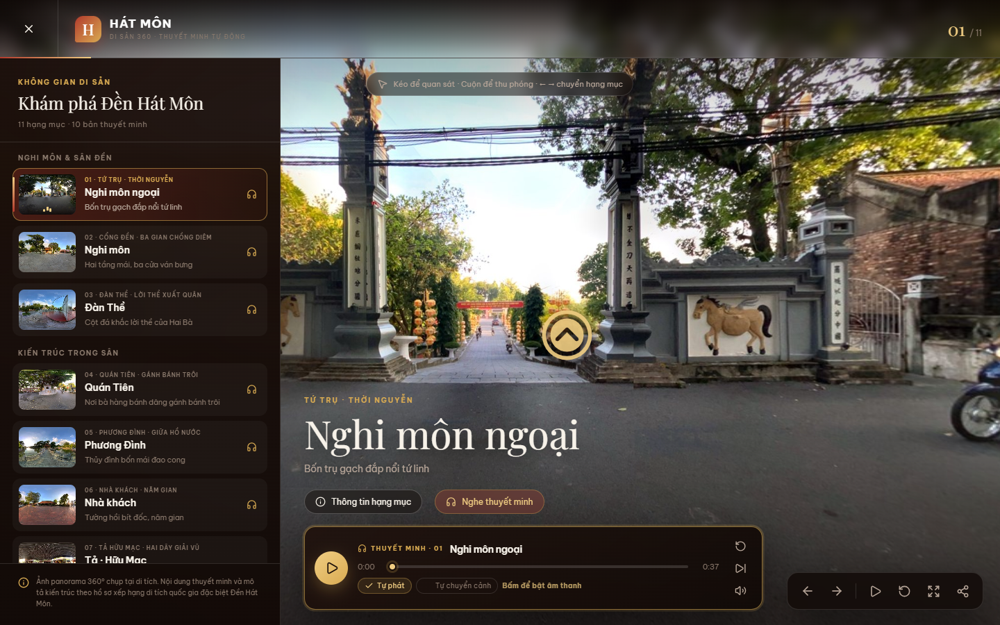

# Đền Hát Môn 360 — tour di sản có thuyết minh

Tour tham quan 360° cho khu di tích quốc gia đặc biệt **Đền Hát Môn** (xã Hát Môn, huyện Phúc Thọ, Hà Nội — nơi thờ Hai Bà Trưng). Ảnh panorama thật, mỗi địa điểm có bản thuyết minh riêng tự phát khi bạn xem tới.

Web app tĩnh, thuần frontend: React + TypeScript + Vite + Photo Sphere Viewer.

> **Muốn tự dựng một tour tương tự cho địa điểm khác?** Xem [`BUILD.md`](BUILD.md) — hướng dẫn từng bước: phân rã bài toán thành 7 phần việc, rồi 39 bước cụ thể kèm bảng tra bẫy.



---

## Chạy dự án

### Yêu cầu

- **Node.js 20.19+** hoặc **22.12+** (đã thử với Node 24). Kiểm tra: `node -v`
- Git

### Ba lệnh

```bash
git clone https://github.com/seck19/HM-tour-360.git
cd HM-tour-360
npm install
npm run dev
```

Mở **http://127.0.0.1:5173/** — xong. Không cần cấu hình gì thêm, không cần backend, không cần biến môi trường.

> **Lưu ý về âm thanh:** trình duyệt chặn tự phát âm thanh cho tới khi người dùng tương tác. Vào trang xong bấm một lần vào bất kỳ đâu (hoặc nút play trên thanh thuyết minh), từ đó thuyết minh sẽ tự chạy mỗi khi chuyển địa điểm.

### Các lệnh khác

| Lệnh | Việc |
|---|---|
| `npm run dev` | Dev server, có hot reload — http://127.0.0.1:5173 |
| `npm run build` | Typecheck (`tsc --noEmit`) rồi build tĩnh ra `dist/` |
| `npm run preview` | Chạy thử bản build trong `dist/` |
| `npm run test:e2e` | Bộ test Playwright (tự bật dev server ở cổng 4173) |
| `npm run crawl` | Thu thập bộ ảnh tư liệu vào `public/reference/` *(không bắt buộc)* |

---

## Cách dùng tour

- **Danh sách địa điểm** ở cột bên trái (trên điện thoại là ngăn kéo, bấm nút ☰). Chia 4 nhóm theo tuyến tham quan.
- **Thanh thuyết minh** ở dưới: play/pause, kéo để tua, nghe lại từ đầu, tới 15 giây, tắt tiếng.
  - **Tự phát** — chuyển địa điểm là tự phát bản thuyết minh mới (mặc định bật).
  - **Tự chuyển cảnh** — hết bản thuyết minh thì tự sang địa điểm kế. Bật cái này rồi ngồi nghe hết một lượt là tiện nhất.
- **Điểm nóng** hình vòng tròn vàng trong không gian 360° — bấm để sang địa điểm liên kết.
- **Kéo** để quan sát, **cuộn** để thu phóng.
- **Bàn phím:** `←` `→` chuyển địa điểm, `Space` phát/dừng, `Esc` đóng bảng thông tin.
- **Chia sẻ:** nút chia sẻ sao chép liên kết kèm `?scene=<id>`, mở ra đúng địa điểm đó.

---

## Cấu trúc dự án

```
src/
  tour-data.ts     ← TOÀN BỘ nội dung tour nằm ở đây
  App.tsx          ← giao diện, trình phát thuyết minh, điều hướng
  styles.css       ← giao diện
  main.tsx
public/
  panoramas/hat-mon/   ← 11 panorama + 11 thumbnail
  audio/               ← 11 bản thuyết minh mp3
  favicon.svg
scripts/
  prepare-media.ps1    ← chuẩn hóa ảnh gốc + copy audio vào public/
  audit-layout.mjs     ← kiểm tra bố cục ở 6 kích thước màn hình
  verify-tour.mjs      ← duyệt hết 11 địa điểm, kiểm tra ảnh/audio/điểm nóng
  screenshot.mjs       ← xuất ảnh chụp vào preview/
  crawl-hat-mon-images.mjs
tests/tour.spec.ts     ← test Playwright
preview/               ← ảnh chụp giao diện
```

---

## Sửa nội dung tour

Mở `src/tour-data.ts`. Mỗi địa điểm là một object:

```ts
{
  id: 'nghi-mon',                                  // dùng cho ?scene=nghi-mon
  name: 'Nghi môn',
  eyebrow: 'CỔNG ĐỀN · BA GIAN CHỒNG DIÊM',
  tagline: 'Hai tầng mái, ba cửa ván bưng',
  group: 'Nghi môn & sân đền',                     // nhóm trong danh sách
  description: '...',                              // đoạn dài trong bảng thông tin
  highlights: ['...', '...'],                      // gạch đầu dòng chi tiết kiến trúc
  panorama: '/panoramas/hat-mon/02-nghi-mon.jpg',
  thumbnail: '/panoramas/hat-mon/02-nghi-mon-thumb.jpg',
  audio: '/audio/02-nghi-mon.mp3',                 // bỏ trống nếu chưa có bản thu
  linkYaw: 0,                                      // hướng đặt điểm nóng dẫn cảnh
}
```

Thứ tự trong mảng `scenes` chính là thứ tự tuyến tham quan, và mỗi địa điểm tự động nối tới địa điểm kế tiếp (địa điểm cuối nối về đầu).

Địa điểm không có `audio` vẫn hoạt động bình thường — thanh thuyết minh sẽ báo "Chưa có bản thu thuyết minh" thay vì vỡ giao diện.

### Tuyến hiện tại

| # | Địa điểm | Nhóm | Thuyết minh |
|---|---|---|---|
| 01 | Nghi môn ngoại (tứ trụ) | Nghi môn & sân đền | 0:37 |
| 02 | Nghi môn | Nghi môn & sân đền | 0:57 |
| 03 | Đàn Thề | Nghi môn & sân đền | 0:32 |
| 04 | Quán Tiên | Kiến trúc trong sân | 0:33 |
| 05 | Phương Đình | Kiến trúc trong sân | 0:29 |
| 06 | Nhà khách | Kiến trúc trong sân | 0:27 |
| 07 | Tả · Hữu Mạc | Kiến trúc trong sân | 0:42 |
| 08 | Đền chính | Nội tự thờ tự | 0:35 |
| 09 | Miếu Tạm Ngự | Nội tự thờ tự | 0:27 |
| 10 | Gò Giấu Ấn | Nội tự thờ tự | 0:37 |
| 11 | Nhà tưởng niệm Nguyễn Thị Định | Tưởng niệm | 0:44 |

---

## Thay ảnh và audio

Tour dùng ảnh **equirectangular tỉ lệ 2:1**. Ảnh gốc của dự án là 6144×3072, được thu nhỏ còn 4096×2048 cho nhẹ.

Script `scripts/prepare-media.ps1` đọc ảnh gốc + mp3 từ thư mục `audio và ảnh hai bà trưng/`, thu nhỏ panorama, tạo thumbnail 480×240 và copy audio vào `public/` với tên slug ASCII (tránh lỗi URL vì dấu tiếng Việt):

```powershell
powershell -ExecutionPolicy Bypass -File scripts\prepare-media.ps1
```

Sửa bảng ánh xạ `$map` ở đầu script nếu bạn đổi tên file nguồn hoặc thêm địa điểm.

> Thư mục ảnh gốc **không được commit** (nặng 65 MB và chỉ cần khi chạy lại script). Nếu clone về mà muốn chạy lại `prepare-media.ps1`, bạn cần tự đặt thư mục `audio và ảnh hai bà trưng/` vào gốc dự án. Còn để **chạy tour** thì không cần — ảnh và audio đã có sẵn trong `public/`.
>
> Script chứa tiếng Việt nên phải lưu ở dạng UTF-8 **có BOM**, nếu không Windows PowerShell 5.1 sẽ đọc sai.

---

## Kiểm tra chất lượng

```bash
npm run test:e2e                  # 5 test Playwright
node scripts/verify-tour.mjs      # duyệt hết 11 địa điểm
node scripts/audit-layout.mjs     # bố cục ở 6 kích thước màn hình
node scripts/screenshot.mjs       # xuất ảnh chụp vào preview/
```

Hai script sau cần dev server đang chạy. Mặc định chúng trỏ vào `http://127.0.0.1:4180`, đổi bằng biến môi trường:

```powershell
$env:SHOT_BASE = 'http://127.0.0.1:5173'; node scripts\verify-tour.mjs
```

`verify-tour.mjs` mở trình duyệt thật, lần lượt bấm qua từng địa điểm và xác nhận: đúng ảnh nền, đúng file thuyết minh, tiêu đề khớp, có điểm nóng dẫn cảnh, thanh thuyết minh không tràn khung, không lỗi HTTP/runtime.

---

## Chia sẻ tạm qua Cloudflare Tunnel

`vite.config.ts` đã mở `allowedHosts: ['.trycloudflare.com']` để Vite không chặn hostname của Quick Tunnel:

```bash
npm run dev
cloudflared tunnel --url http://127.0.0.1:5173
```

Lệnh thứ hai in ra một URL `https://<tên-ngẫu-nhiên>.trycloudflare.com` dùng được ngay. URL đổi mỗi lần chạy lại, và đây là **dev server mở ra Internet** — ai có link đều xem được cả mã nguồn trong `src/`, nên chỉ dùng để review nhanh rồi tắt.

---

## Nguồn tư liệu

Nội dung mô tả kiến trúc tham chiếu hồ sơ xếp hạng di tích của Cục Di sản văn hóa — [Đền Hát Môn](http://dsvh.gov.vn/di-tich-lich-su-den-hat-mon-2971), di tích quốc gia đặc biệt theo Quyết định 2383/QĐ-TTg ngày 09/12/2013.

Ảnh panorama 360° và bản thu thuyết minh do chủ dự án thực hiện.

Hai thư mục sau **không được commit** vì không còn được tour sử dụng:

- `public/reference/` (~114 MB) — bộ ảnh tư liệu thu thập bằng `npm run crawl`, là nguyên liệu cho bản demo cũ. Bản quyền ảnh thuộc đơn vị xuất bản gốc; ảnh từ Wikimedia Commons có giấy phép ghi theo từng file trong `sources.json`.
- `public/panoramas/ai/` (~15 MB) — panorama minh họa AI của bản demo cũ, đã được thay bằng ảnh chụp thật.
